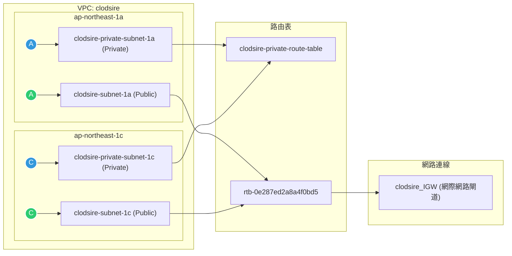

```mermaid
graph LR
    %% 定義 VPC
    subgraph VPC [VPC: clodsire]
        direction LR
        
        %% 定義可用區與子網路
        subgraph AZ1 [ap-northeast-1a]
            A((A)):::public --> clodsire-subnet-1a["clodsire-subnet-1a (Public)"]
            B((A)):::private --> clodsire-private-subnet-1a["clodsire-private-subnet-1a (Private)"]
        end
        
        subgraph AZ2 [ap-northeast-1c]
            C((C)):::public --> clodsire-subnet-1c["clodsire-subnet-1c (Public)"]
            D((C)):::private --> clodsire-private-subnet-1c["clodsire-private-subnet-1c (Private)"]
        end
    end

    %% 定義路由表
    subgraph RouteTables [路由表]
        RT1["clodsire-private-route-table"]
        RT2["rtb-0e287ed2a8a4f0bd5"]
    end

    %% 定義網路連線
    subgraph Network [網路連線]
        IGW["clodsire_IGW (網際網路閘道)"]
    end

    %% 連線關係
    clodsire-private-subnet-1a --> RT1
    clodsire-private-subnet-1c --> RT1
    
    clodsire-subnet-1a --> RT2
    clodsire-subnet-1c --> RT2
    
    RT2 --> IGW

    %% 樣式設定
    classDef public fill:#2ecc71,stroke:#fff,stroke-width:2px,color:#fff;
    classDef private fill:#3498db,stroke:#fff,stroke-width:2px,color:#fff;
```
