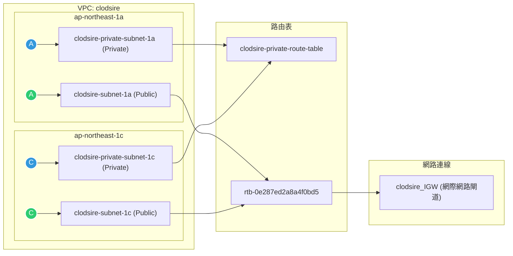

1.AI應用
2.網路設計
3.多網路串接
4.GCP
5.高

智商>LLM
職務描述>prompt
產品手冊>knowledge
外部溝通>plugin
印象>memery   ->把關>guard

補充:
Mcp config
Mcp platform
Composio mcp
Aws vpc reachability

Dify LLM AI agent實作:
用戶輸入內容,Agent抓取重點存入變數記憶 行為記憶
實作:開始>新增變數:欄位-段落,變數名稱
        輸出>輸出變數
       開始 — 新增LLM — 輸出

補充:
AI grounding

開始 — 新增知識庫 —LLM
HTTP請求:
(測試網址)https://jsonplaceholder.typicode.com/users

補充:aws bedrock guardrails

Network vpc建置

Igw> private subnet>route table >NACL >SG >EC2

建置需考慮backup (至少兩個區域)
一個subnet只會在一個AZ裡

步驟:
1.建立網際網路閘道 >2.將網際網路閘道附加到 VPC>3.設定路由表 
4.建立兩個公有subnet在不同AZ(考慮備援)

!!!提示詞:建立兩個私網段不能透露route table(私有網段專用route table)!!!

5.為私有子網路建立獨立的路由表> 6.建立兩個私有子網路 >7.將私有子網路綁定至私有路由表 >8.測試

